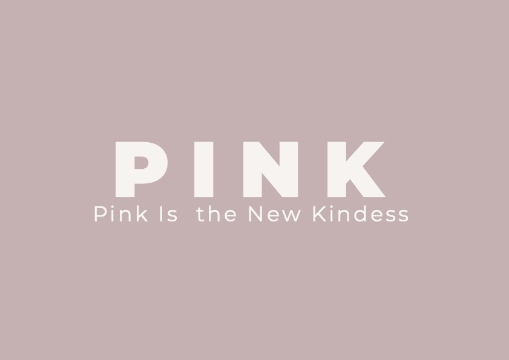
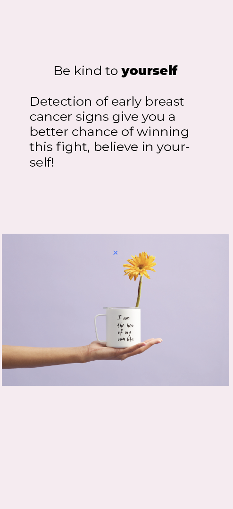
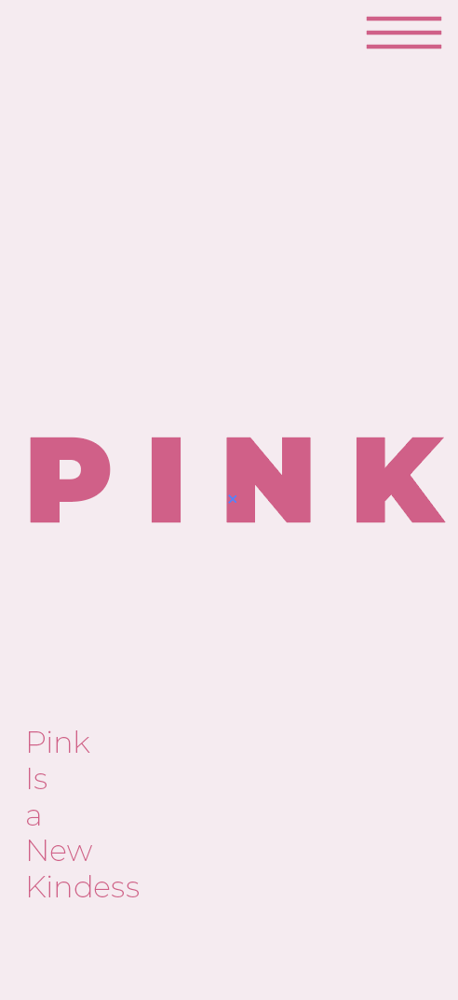
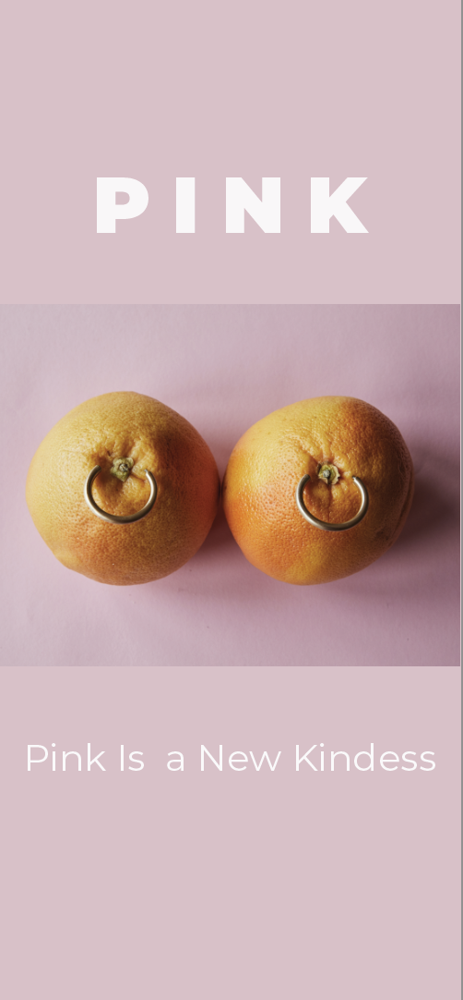
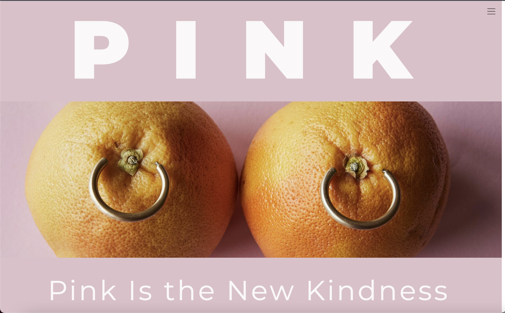

# 🎗️ Pink is a new kindness 🎗️

## Introduction

Welcome to our project called 'PINK is the New Kindness'.

Thanks to the [Code Institute](https://codeinstitute.net/) and [IT Labs](https://www.it-labs.com/), we were honored to take a part in this amazing  Women in Tech Nov'21 #14 collaboration to promote Breast Cancer Awareness. A noble cause we were proud to be part of. 

Also a big thank you to IT Lab representative and team facilitator, [Aleksandra Vinokjikj](https://github.com/alexvinokikj) who watched over the entire project and guided us along the way.

We hope you like this project as much as we enjoyed building it! 

We welcome you to step into our world of Kindness. 

## The Team

PINK team memebers:

* [Estephanie Standen](https://github.com/Esteph27) [HTML, CSS, JavaScript, Python]
* [Sophie Nagle](https://github.com/sophnagle) [HTML, CSS, JavaScript, UX/UI]
* [Dee Cooper](https://github.com/deecooper)
* [Rocky Chan](https://github.com/cloki0610)
* [Kamil Kwiatkowski](https://github.com/kamil-kw) - Team Leder, skilled in [HTML, CSS , JavaScript, Python, Java, Bootstrap]

## Live Site
<!-- [nameOfSite](siteURL)) -->

The live site can be found [HERE](https://kamil-kw.github.io/pink-is-the-new-kindness/#).

<!--  -->

## Repository
<!-- [repoLocation](repoLocation) -->
***

## Table of Contents

- [Name of project](#name-of-project)
  - [Live Site](#live-site)
  - [Repository](#repository)
  - [Table of Contents](#table-of-contents)
  - [Objective](#objective)
  - [Brief](#brief)
    - [nameOfSite](#nameofsite)
  - [UX &#8722; User Experience Design](#ux--user-experience-design)
    - [User Requirements](#user-requirements)
    - [Initial Concept](#initial-concept)
      - [Wireframes](#wireframes)
      - [Colour Scheme](#colour-scheme)
      - [Typography](#typography)
      - [Imagery](#imagery)
  - [Features](#features)
    - [Existing Features](#existing-features)
    - [Features Left to Implement](#features-left-to-implement)
  - [Technologies Used](#technologies-used)
  - [Testing](#testing)
  - [Bugs](#bugs)
    - [Current](#current)
    - [Resolved](#resolved)
  - [Development](#development)
  - [Deployment](#deployment)
  - [Credits](#credits)
    - [Content](#content)
    - [Media](#media)
    - [Acknowledgements](#acknowledgements)
    - [Personal Development](#personal-development)

***

## Brief

The goal for this event was to raise Breast Cancer Awareness focusing on the following; providing helpful information and resources to the user relating to Breast Cancer, offer tips and guidance on how to detect signs early, and share personal stories to raise awareness. 

## PINK - Concept

As a name for the team and in keeping with the brief, we chose to create an acronym from the word PINK and came up with; *PINK Is the New Kindness* where Kindness underpins the values and aim of our project:

**P**ink

**I**s the

**N**ew

**K**indness

It's all about kindness towards surrounding members of family and friends, the world around you, and most importantly, yourself. Therefore our motto is "be kind":

* Be kind to **yourself** – detection of early breast cancer signs, give you a great chance of winning this fight. Believe in your strength!
* Be kind to **family & friends** – they need you in their lives, and they will be there for you.
* Be kind to **world** – Good people deserve to live and contribute to our society.

The goal of this website is to provide resources for users on how they can best support themselves, their friends and family, and the wider community, who have been affected by Breast cancer.

It contains a collection of external resources for each of these three parts (individual, friends/family, world) so the user can easily find information depending on their personal needs and circumstances. 

There are also real-life user stories shared from the community and a form that allows a user to submit and share their own personal experiences with Breast Cancer. 

## Wireframes

These are the initial wireframes from our initial project mind-map and scoping:

Initial ideas for mobile phone layout:

 

## UX Design

Breast cancer, or any type of cancer, can be daunting and sometimes devastating. With this in mind, PINK needed to be a place that was warm, happy and inviting. A space where users feel welcomed but also catches their attention. Additionally, as kindness underpins the values for this project, we wanted to ensure this was reflected in our UX. We’ve achieved this through our selective use of colours, light-hearted imagery, icons and fonts. 

The overall aesthetic is clean, modern and “light”. Where often finding information online about breast cancer can be overwhelming, we wanted PINK to be clean and clear for the user. A place where information isn’t in your face, but gently handed to you.

#### Colour Palette:

The prominent colour is pink, as pink is not only the name of the project, but also the symbol for breast cancer awareness and it was important to respect this association. Along with the colour pink, we created a custom colour palette which not only compliments the imagery throughout the website, but connotes the feeling of kindness, happiness and hope. 

#### Fonts:

To keep within the theme and overall aesthetic, we decided for the below fonts which are used throughout the site: 

Monsterrat Bold - header and subtitles

Monsterrat regular - copy text 

#### Imagery:

We have used light-heart and tongue-and-cheek imagery throughout the site as we wanted to steer clear from any feeling of being too clinical or “serious”. Breast cancer can be a heavy topic for the user, by implementing these light-hearted images we hope to create a bit of fun for the user and lift a little bit of that weight and worry.

### User Requirements

PINK is a platform for everyone. From the person who has Breast cancer, to the person who has a loved one with Breast cancer, to the normal person who just wants to support and raise awareness. With this in mind there are 3 main users, here are some user stories:

* I want to educate myself and understand how and what I should check for when looking out for potential signs of Breast Cancer
* I want to learn how I can support friends and family that are going through a bereavement
* I want to find out how I can help someone going through a diagnosis or treatment
* I want to learn how I can support myself through a bereavement
* I want to learn how I can support myself through Breast cancer diagnosis 
* I want to find out how I can help the wider research of cancer treatments and preventative action
* I want to find ideas on how I can raise money for cancer charities
* I want to read stories of those with similar experiences
* I want to share my own expereinces with the community 

<!-- user stories here -->
***

## Features

### Existing Features

### Landing page:
Being the first page the user lands on, we wanted the landing page to be welcoming as well as visually impactful to the user. We achieved this through keeping it simple yet effective with the use of our tongue-and-cheek hero image which is placed centrally across the screen. The name of the project is also placed centrally on the screen in large and bold letters to shout our name out load and proud. The slogan below the hero image also tells the user what the project name stands for clearly so the user knows what to expect. 

### Stories page (Esteph):

### Nav bar (Kamil):

### Kindness section (Dee):

### Information section (Dee):

### Carousel (Rocky):
We have two carousel in our website. These components provdied by Bootstrap framework and it is a slideshow for cycling through a series of content, built with CSS 3D transforms and a bit of JavaScript. It works with a series of images, text, or custom markup. It also includes the previous/next controls and indicators. User can use the controls and indicators to view three images in the indicators.

### Story contact form (Kamil/Rocky):

### Footer (Dee):

### Animations (Sophie):

I have made a scale animation using CSS and JS so that on hover elements with the class of 'scale' enlarge by 20%. This is used on the main page on our values section and also changes background colour. 

On the stories page, we have created animations so that when a user hovers over 'We are in this together' it scales up, changes colour to pink and permanently stays this way. This is done using javascript to add a class with these permanent styles.

        $(document).ready(function () {
            $(".subHeader").one("mouseover", function() {
            $(".subHeader").addClass("permahover");
        });
        });

Finally, I have added a pulse and change colour effect on the Share your story form using CSS keyframes. These animations help in keeping the user engaged and want to contribute.

The chosen effects tie in with the brand aestetic we were looking for; accessible, light-hearted and contemporary.

### Fade on scoll (Sophie):

I have created a JavaScript function so elements that are given a class of 'fade' are faded into the window. The speed can be changed in the function. This gives a nice smooth, soft effect on bringing the elements into the screen. It gives a smooth user experience.

### Scroll back to top (Sophie):

I have added a link at the bottom of the pages so the user can quickly go back to top for enhanced user experience. This is a small addition but can greatly improve the experience and help the user navigate the site.

### Fav icon (Kamil):

<!--add remaining features below: -->

### Features Left to Implement

<!-- features left to implement -->
<!-- 1. Explain desired feature 1
  - *Notes regarding feature*
  - Explanation of feature need etc. -->
<!-- 2. Explain desired feature 2
  - *Notes regarding feature*
  - Explanation of feature need etc. -->
***

## Technologies Used

### **During my page creation journey I did use:**

* [HTML5](https://en.wikipedia.org/wiki/HTML)
    * Current project uses HyperText Markup Language.
* [CSS3](https://en.wikipedia.org/wiki/CSS)
    * Current project uses Cascading Style Sheets.
* [JavaScript](https://en.wikipedia.org/wiki/JavaScript)
    * To provide animation and API conection
* [Chrome](https://www.google.com/intl/en_uk/chrome/)
    * Chrome dev tool used to debug and test code while building
* [Balsamiq](https://www.figma.com/)
    * To create wireframes during design
* [Google Fonts](https://fonts.google.com/)
    * Used as a source of Poppins font
* [Font Awsome](https://fontawesome.com/)
    * To provide icons to page
* [Github](http://github.com)
    * For storing project code written in gitpod
* [W3C Markup](https://validator.w3.org/)
    * Validation tool to validate the HTML code and CSS style used in the project.
* [Jigsaw](https://jigsaw.w3.org/) 
    * Validation tool to validate the Javascript code style.
* [W3School](https://www.w3schools.com/)
    * For problem solving and code searching
* [Am I responsive design](http://ami.responsivedesign.is/)
    * To test responsiveness in end product and create readme screenshots
* [Beautifier - Free Formater](https://www.freeformatter.com/html-formatter.html) 
    * Used to improve HTML and CSS code presentation
* [Google API]()
    * 

[Back to Table Of Content](#tableOfContents)

## Testing

<!-- explain testing
? item tested
? expected result
? how test was performed
? actual result
? differences
? action required
? re-test
- more detail and better format required compared with project 1
look at daisy's testing documentation and [webinar](https://us02web.zoom.us/rec/play/9FIKllHX2ZiQNFRhYPn_hBh_ZeA8964ZvIDLnhpKGAf1NLVc3_hBJ6zSL8Hv5Hx7ALnPtDmbg8CmFAs.YVsZ9LR_uI7OjEwH)-->

<!-- validation of html, css and script. -->
<!-- lighthouse testing -->

## Bugs

### Resolved Bugs 

1.	Scale JavaScript/CSS

We have made a scale transition so that on hover, any element with the class 'scale' enlarges by 20% and changes background color. On testing on a separate branch, it worked but after merging with the main branch it stopped. Testing in the console showed the correct element was picked up and reviewing the code showed it was logical. Post merge we found it worked – there may have been a delay in it going through to the live site! 

2.	Fade JavaScript 

We have added a fade in on scroll. The initial code was built so that an object faded in when the whole element was in the window as per the below code:

    $(document).ready(function () {
        /* Every time the window is scrolled ... */
        $(window).scroll(function () {
            /* Check the location of each desired element */
            $(".fade").each( function() {
                
                let bottom_of_object = $(this).offset().top + $(this).outerHeight();
                let bottom_of_window = $(window).scrollTop() + $(window).height();

                /* If the object is completely visible in the window, fade it it */
                if( bottom_of_window > bottom_of_object ){
                    
                    $(this).animate({'opacity':'1'}, 1000);
                }
            }); 
        });
    }); 

However on testing we thorught that this looked like it was loading the page too slowly and it did not give the effect we wanted. We changed this so that it fades in on enter and at a faster screen. We have gone with this code and taken out the need for the whole element to be above the bottom of the screen: 

    $(document).ready(function () {
        /* Every time the window is scrolled ... */
        $(window).scroll(function () {
            // Check the location of each desired element with a fade class */
            $(".fade").each( function() {
                // fade in
                $(this).animate({'opacity':'1'}, 2000);
            }); 
        });
    });

3.	Back to Top Link 

This was a typo in that the <i> element from font-awesome wasn’t copied correctly. 

It was corrected from:

    

        <a href="#" class="fas fa-chevron-up">
          Back to Top
        </a>
    

To:

    

      <a href="#"><i class="fas fa-chevron-up"></i>
        Back to Top
      </a>
    

4.	Intro Section and colour change on headers

When adding the introduction paragraph and image, we found that it conflicted with the landing page and pushed the h3 sub-heading out when on a desktop screen. 

To counter this, we added padding to the top and edited the background-colour to match the landing page so that the transition is smooth and unnoticed as below. 

    .intro {
        padding: 100px 40px;
        font-size: 1.2rem;
        background-color: #DDC0C8;
      }

### Unfixed Bugs
<!--write here is any unfixed bugs-->

We note that there is a small overflow on the righthand side on the main page on the landing section and the subheader. 

On testing we think this code is a bootstrap/div bug. It needs further exploration to fix. 

## Development

<!-- section missed in first project. 
!describe development process -->

## Deployment

<!-- !check this section, may need adjusting as using additional languages -->

<!-- **Github Pages**
- Navigate to the relevant GitHub Repository [here](github repo URL)
- Select "Settings" from the options below the name of the repository

- Select "Pages" from the left hand menu

- Select "Branch: main" as the source and leave the directory as "/(root)"

- Click the Save button
- Take note of the URL provided

- GitHub takes a short while to publish the page. The bar turns green if you refresh the pages tab and the page has been deployed

- Click the link or copy the URL to a browser to reach the deployed page
https://daveyjh.github.io/ci-portfolio-one-v4/
The site is now live and operational -->
***

## Technologies used:

1. HTML
- Markup language providing content and structure of website.

2. CSS
- Styling language providing website styles and appearance.

3. Javascript
- User interactivity 

## Validation:

1. W3C HTML 
- HTML code passed with no errors
- CSS code passed with no errors

2. Jigsaw
- JavaScript passed with no erros

## Credits

* Images from pexel.com and unsplash.com

* Favicon for fav icon

* Google Fonts for fonts

* Font Awesome for icons

### Content
<!-- - the a comes from b -->
<!-- - the c comes from d -->
### Media
<!-- - the a comes from b -->
<!-- - the c comes from d -->
### Acknowledgements
<!-- - acknowledge a, found at [b](bURL), for c -->
<!-- - acknowledge d, found at [e](eURL), for f -->
* Code Institue for hosting the event
* IT Labs for hosting the event 
* [Aleksandra Vinokjikj](https://github.com/alexvinokikj) for being the team facilitator 
***

### Personal Development

<!-- notes -->
